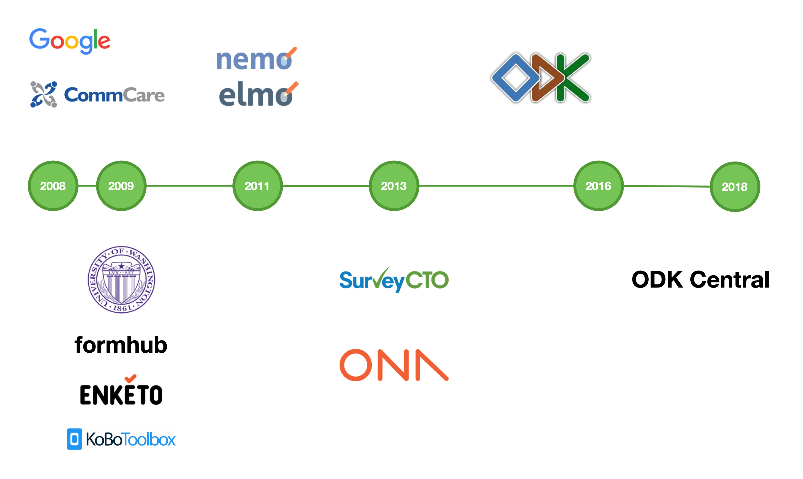
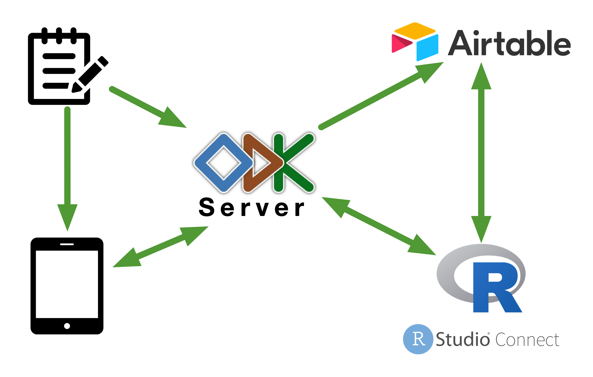

```{r setup, include=FALSE}
options(htmltools.dir.version = FALSE)
```

```{r xaringan-themer, include=FALSE, warning=FALSE}
library(xaringanthemer)
style_mono_light(
  base_color = "#509935",
  base_font_size = "25px",
  title_slide_background_color = "#FFFFFF",
  title_slide_background_image = "images/ecohealth_title_background_4by3.png",
  title_slide_background_size = "contain",
  title_slide_text_color = "#509935",
  background_image = "images/ecohealth_slide_background_4by3.png",
  header_font_google = google_font("Fira Sans"),
  text_font_google = google_font("Fira Sans Condensed"),
  code_font_google = google_font("Fira Mono"),
  text_slide_number_font_size = "1em"
)
```

# Outline

* Brief overview of **Open Data Kit** development

* **Open Data Kit** within **EcoHealth Alliance**

* **ODK Central** demonstration

---

background-image: url()
background-color: #FFFFFF

## ODK development



<!---  --->

---

background-image: url()
background-color: #FFFFFF

## ODK within EcoHealth



---

## ODK Central

* **ODK Central** is the newest iteration of the **ODK server**. 

* It manages user accounts and permissions, stores form definitions, and allows data collection clients like **ODK Collect** to connect to it for form download and submission upload

* New features and functionalities in the server software itself and via its **REST**, **OpenRosa**, and **OData** APIs

---

## ODK Central demonstration

For this demonstration, I have created a feedback form for my talk today which we will use to demonstrate the following:

* How to deploy a form in **ODK Central**

* How to submit a form to **ODK Central**

* How to monitor submission of forms to **ODK Central**

* How to create basic visualisation of data from forms submitted to **ODK Central**

---

## What you need

* A data entry device ideally a mobile device running on **Android** (smartphone or tablet), or an **iOS** device, or a computer with a web browser

* An internet connection

* If using an **Android** device, please download **ODK Collect** from the **Google Play Store**. 

* If you do not want to download yet another app or if you are using **iOS** device or a computer, nothing to download ahead of time. You will enter data into the forms and submit via your web browser

