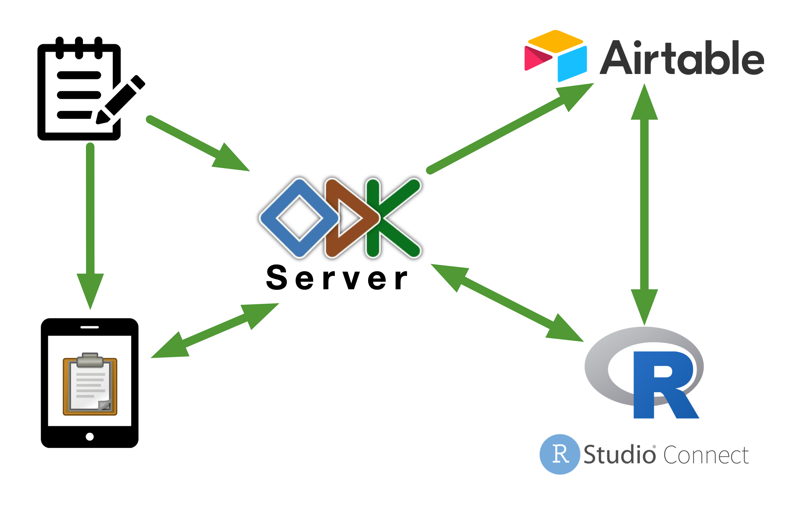

```{r setup, include=FALSE}
options(htmltools.dir.version = FALSE)

## Libraries
library(ruODK)
library(dplyr)
library(knitr)
library(kableExtra)
```

```{r xaringan-themer, include=FALSE, warning=FALSE}
library(xaringanthemer)
style_mono_light(
  base_color = "#509935",
  base_font_size = "25px",
  title_slide_background_color = "#FFFFFF",
  title_slide_background_image = "images/ecohealth_title_background_4by3.png",
  title_slide_background_size = "contain",
  title_slide_text_color = "#509935",
  background_image = "images/ecohealth_slide_background_4by3.png",
  header_font_google = google_font("Fira Sans"),
  text_font_google = google_font("Fira Sans Condensed"),
  code_font_google = google_font("Fira Mono"),
  code_font_size = "0.7rem",
  text_slide_number_font_size = "1em"
)
```

## What you need for the demonstration

* A data entry device ideally a mobile device running on **Android** (smartphone or tablet), or an **iOS** device, or a computer with a web browser

* An internet connection

* If using an **Android** device, please download **ODK Collect** from the **Google Play Store**. 

* If you do not want to download yet another app or if you are using **iOS** device or a computer, nothing to download ahead of time. You will enter data into the forms and submit via your web browser

---

# Outline

* Brief overview of **Open Data Kit** development

* **Open Data Kit** within **EcoHealth Alliance**

* **ODK Central** demonstration

---

background-image: url()
background-color: #FFFFFF

## ODK development


<!---  --->

---

background-image: url()
background-color: #FFFFFF

## ODK within EcoHealth



---

## ODK Central

* **ODK Central** is the newest iteration of the **ODK server**. 

* It manages user accounts and permissions, stores form definitions, and allows data collection clients like **ODK Collect** to connect to it for form download and submission upload

* New features and functionalities in the server software itself and via its **REST**, **OpenRosa**, and **OData** APIs

---

## ODK Central demonstration

For this demonstration, I have created a feedback form for my talk today which we will use to demonstrate the following:

* How to deploy a form in **ODK Central**

* How to submit a form to **ODK Central** (collecting data)

* How to monitor submission of forms to **ODK Central**

* How to get **ODK Central** data into R

---

## Setting up your project in ODK Central

* Create a web user account

* Create a project and choose web users to include in project

* Web users within a project can have varying permissions levels (admin, read, submit)

---

## Deploy form in ODK Central

* Create a form in XLSForm standard

    * Demonstration form at [GithHub repo](https://github.com/ecohealthalliance/opendatakit/forms/feedback_m3_form.xlsx) and on [Google Sheets](https://docs.google.com/spreadsheets/d/1T_99G7_3pookXGro_iw1wERF5SX2eUdJRzo2TvkgSBM/edit?usp=sharing)

* Publish form into **ODK Central**

---

## Submit forms to ODK Central

* Create *app users* on **ODK Central**

* Connect *app users* to **ODK Central**

* *App users* click on *Get Blank Form* on **ODK Collect**

* *App users* click on *Fill Blank Form* and select form to fill on **ODK Collect**

---

## Connect to ODK Central via R

```{r odksetup, eval = FALSE}
## Install ruODK from GitHub
remotes::install_github("ropensci/ruODK")

## Setup connection with ODK Central
ruODK::ru_setup(
  svc = "https://odk-beta.eha.io/v1/projects/1/forms/pizza.svc",
  un = "YOUR_USERNAME_HERE",
  pw = "YOUR_PASSWORD_HERE",
  tz = "GMT",
  odkc_version = "1.1.2"
)
```

```{r odksetup_run, echo = FALSE, eval = TRUE}
ruODK::ru_setup(
  svc = "https://odk-beta.eha.io/v1/projects/1/forms/pizza.svc",
  un = Sys.getenv("ODK_USERNAME"),
  pw = Sys.getenv("ODK_PASSWORD"),
  tz = "GMT",
  odkc_version = "1.1.2",
  verbose = FALSE
)
```

---

## Get list of projects

```{r projectList}
## Get list of projects
project_list()
```

```{r projectList_tab, echo = FALSE}
## Get list of projects
project_list() %>%
  knitr::kable() %>%
  kableExtra::kable_styling(bootstrap_options = c("condensed"),
                            position = "center",
                            html_font = "Arial Narrow", font_size = 16)
```

---

## Get list of forms

```{r formList}
form_list(pid = 1)
```

```{r formList_tab, echo = FALSE}
form_list(pid = 1) %>%
  knitr::kable() %>%
  kableExtra::kable_styling(bootstrap_options = c("condensed"),
                            position = "center",
                            html_font = "Arial Narrow",
                            font_size = 10)
```

---

## Get form schema

```{r formSchema}
form_schema(odkc_version = "1.1.2")
```

---

## Get form schema (stylised output)

```{r formSchema_tab, echo = FALSE}
form_schema(odkc_version = "1.1.2") %>%
  head() %>%
  knitr::kable() %>%
  kable_styling(bootstrap_options = c("condensed"),
                position = "center",
                html_font = "Arial Narrow", font_size = 20)
```

---

## List submissions for one form

```{r submissionsList}
submission_list()
```

---

## List submissions for one form (stylised output)

```{r submissionsList_tab, echo = FALSE}
submission_list() %>%
  knitr::kable() %>%
  kableExtra::kable_styling(bootstrap_options = c("condensed"),
                            position = "center",
                            html_font = "Arial Narrow", font_size = 14)
```

---

## Get data from all submissions

```{r getSubmissionsFlat}
odata_submission_get(odkc_version = "1.1.2")
```

---

## Get data from all submissions (stylised output)

```{r getSubmissionsFlat_tab, echo = FALSE}
odata_submission_get(odkc_version = "1.1.2") %>%
  select(id:system_submitter_name) %>%
  knitr::kable() %>%
  kableExtra::kable_styling(bootstrap_options = c("condensed"),
                            position = "center",
                            html_font = "Arial Narrow", font_size = 14)
```

---

class: center, middle

# Questions?

---

class: center, middle

# Thank you!

Slides can be viewed at https://ecohealthalliance.github.io/opendatakit or PDF version downloaded at https://ecohealthalliance.github.io/opendatakit/opendatakit.pdf

R scripts for slides available at https://github.com/ecohealthalliance/opendatakit

Demo ODK forms available at https://github.com/ecohealthalliance/opendatakit/forms

